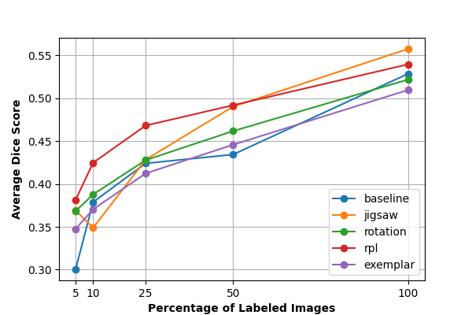
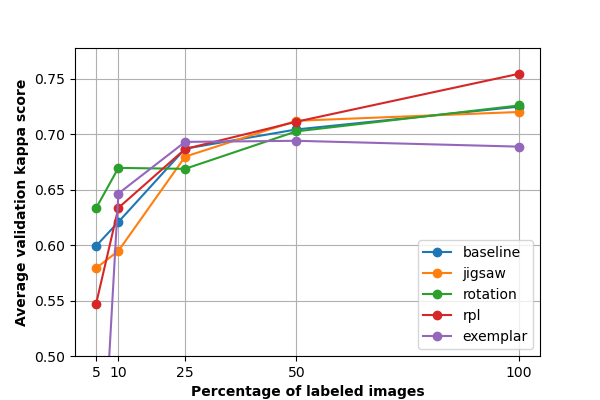

# Self-Supervised Learning for 2D and 3D Medical Imaging Data

## Introduction
This project aims to reimplement the paper [3D Self-Supervised Methods for Medical Imaging](https://arxiv.org/abs/2006.03829) (original repo can be found [here](https://github.com/HealthML/self-supervised-3d-tasks)).  This paper demonstrates that self-supervised learning (SSL) substantially improves downstream segmentation and classification performance, especially in small data regimes. Their key contributions are: 1) Formulation of five 3D SSL tasks, 2) Open‑source implementations of SSL tasks, and 3) Comprehensive evaluations on pancreas tumor segmentation, brain tumor segmentation, and diabetic retinopathy classification, empirically demonstrating efficiency gains produced by SSL.

## Chosen Result
We recreated the pancreas segmentation data-efficiency curves (left, from Figure 3 of Taleb et al.) on a 3D UNet for four of the five SSL tasks: jigsaw, rotation, rpl, and exemplar. We also recreated the diabetic retinopathy classification data-efficiency curves (right, from Figure 4 of Taleb et al.) on a DenseNet‑121 backbone for the same SSL tasks.

<p float="left">
  
  
</p>

## Code Layout
All code relevant to this project is in the `code` directory. We have split the code into `3d` and `2d` for better separation and understanding of how the pretext and training tasks work. See the [Reproduction Steps](#reproduction-steps) section below on how to install necessary dependencies and run the code.

## Reimplementation Details
We reimplemented the models and pretext tasks using PyTorch, creating our own 3D UNet and using the DenseNet-121 implementation provided by torchvision. We pretrained the 3D UNet on unlabeled CT volumes and finetuned on the same subsampled sets of labeled scans from the [Medical Segmentation Decathlon](http://medicaldecathlon.com) dataset, assessing downstream performance with Dice score. Similarly, we pretrained the DenseNet-121 on fundus images from the [APTOS 2019 Blindness Detection](https://www.kaggle.com/competitions/aptos2019-blindness-detection) dataset, measuring downstream classification performance with Quadratic Weighted Kappa.

## Reproduction Steps
This project requires installing Python (preferably 3.12) with the `venv` module.
It also assumes you have CUDA installed, with version 11.8 or greater. If this is
not the case, you may need to modify the PyTorch installation in `setup.sh`.

To start, you must configure your Kaggle account to download the APTOS 2019 Blindness Detection dataset:

1) Ensure you have a Kaggle account created: https://www.kaggle.com/
2) Create a Kaggle API token. To do this, navigate to your Kaggle Settings (https://www.kaggle.com/settings), scroll down, and click "Create New Token". This will download a kagge.json file which you need to move into the root of this repository.
3) Navigate to the APTOS 2019 Blindness Detection Kaggle page (https://www.kaggle.com/competitions/aptos2019-blindness-detection/data), scroll down, and agree to the competition rules. You must do this before Kaggle will let you download the data.

Then, execute the following:

```bash
git clone git@github.com:mattrrubino/self-supervised-medical.git
cd self-supervised-medical
./code/setup.sh
. venv/bin/activate
```

### 3D Experiments
To train and finetune the 3D models, run the following from the project root:

```bash
python code/3d/exp.py
```

Note that this will take several days to run. You can reduce the amount of time it takes by lowering `PRETEXT_EPOCHS` and `FINETUNE_EPOCHS` in `code/3d/exp.py`. However, this will affect performance.

After training the models, you can generate the result graphs by running the following from the project root:

```bash
python code/3d/graph.py
```

The output graph will be located at `results/train_pancreas.png`.

### 2D Experiments
To train and finetune the 2D models, run the following from the project root:

```bash
python code/2d/exp.py
```

Note that this will also take a long time to run. You can reduce the amount of time it takes by lowering `PRETEXT_EPOCHS` and `FINETUNE_EPOCHS` in `code/2d/exp.py`. However, this will affect performance.

After training the models, you can generate the result graphs by running the following from the project root:

```bash
python code/2d/graph.py
```

The output graph will be located at `results/train_fundus.png`.

## Results/Insights
Our data efficiency graphs are included below (left is pancreas and right is fundus), where we observe similar trends to the authors. Specifically, all of the pretext tasks, with the exception of exemplar, improve downstream task efficiency.

<p float="left">
  
  
</p>

## Conclusion
Our reimplementation of Taleb et al.’s 3D self-supervised methods proved both challenging and enlightening. We confirmed the paper’s central thesis that self-supervision can address the annotation bottleneck in medical imaging. Despite hurdles with memory constraints when scaling to larger 3D volumes, our results largely followed the original paper’s. However, the worse exemplar performance compared to the paper’s suggests that our negative sampling approach may need to be optimized further. In future experiments, we plan to extend these methods by applying self-supervised losses not only to the final encoder output, but also at intermediate encoder layers, with the goal of enriching feature quality for decoding. We also aim to explore joint training on multiple pretext tasks simultaneously, and to leverage a multi-GPU setup to accommodate larger batch sizes and more complex 3D SSL schemes. 

## References
[1] 	A. Taleb et al., ‘3D self-supervised methods for medical imaging’, in Proceedings of the 34th 
International Conference on Neural Information Processing Systems, Vancouver, BC, Canada, 2020.

[2] 	O. Ronneberger, P. Fischer, and T. Brox, ‘U-Net: Convolutional Networks for Biomedical Image 
Segmentation’, in Medical Image Computing and Computer-Assisted Intervention -- MICCAI 2015, 2015, pp. 234–241.

[3] 	A. Simpson et al., ‘A large annotated medical image dataset for the development
and evaluation of segmentation algorithms’, CoRR, vol. abs/1902.09063, 2019.

[4] 	M. Karthik and S. Dane, ‘APTOS 2019 Blindness Detection’, Kaggle, 2019.

[5] 	G. Huang, Z. Liu, L. Van Der Maaten, and K. Q. Weinberger, ‘Densely Connected Convolutional 
Networks’, in 2017 IEEE Conference on Computer Vision and Pattern Recognition (CVPR), 2017, pp. 2261–2269.

## Acknowledgements
This work was completed as part of Cornell University's deep learning class [CS5782](https://www.cs.cornell.edu/courses/cs4782/2025sp).

