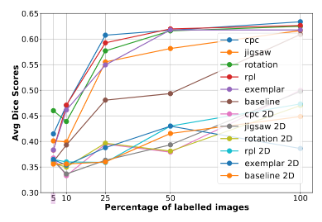
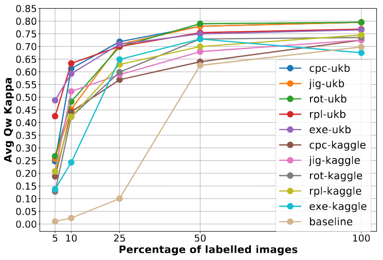
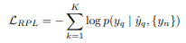
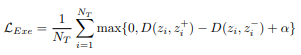

# Self-Supervised Medical for 2D and 3D Tasks


## Introdcution
This project aims to reimplement the Paper ["3D Self-Supervised Methods for Medical Imaging"](https://arxiv.org/abs/2006.03829)(original repo can be found [here](https://github.com/HealthML/self-supervised-3d-tasks)).  This paper demonstrates that 3D pretext tasks substantially improve downstream segmentation and classification accuracy, especially in small data regimes. Their key contributions are: 1) Formulation of five 3D SSL tasks, 2) Open‑source implementations of SSL tasks, and 3) Comprehensive evaluations on pancreas tumor segmentation, brain tumor segmentation, and diabetic retinopathy classification, empirically demonstrating efficiency gains produced by SSL.


## Results Chosen for Re-Implemenation
We recreated the pancreas segmentation data-efficiency curves (left, from Figure 3 of Taleb et al.) on a 3D UNet for four of the five SSL tasks: jigsaw, rotation, rpl, and exemplar. 

<p float="left">
  
  
</p>


## Code Layout
All code relevant to this project is in the `code` directory. We have split the code into `3d` and `2d` for better separation and understanding of how the pre-text and training tasks work. See the Install section below on how to install necessary dependencies and run the code.

## Re-implementation Details
Rotation, jigsaw, rpl are trained with cross entropy loss, where each target class is 10, 100, 25 respectively, following the equation below:



For exemplar training, contrastive loss is used, where the taget class is 1024 embeddings size, following the loss function below:



We pretrained the model on unlabeled CT volumes and finetuned on the same subsampled sets of labeled scans from the [Medical Segmentation Decathlon dataset](http://medicaldecathlon.com/), assessing downstream performance with Dice score. We also reproduced the diabetic retinopathy data‑efficiency curves (right, from Figure 4 of Taleb et al.) on a DenseNet‑121 backbone. We pretrained the model on [2D UK Biobank fundus images](https://www.kaggle.com/competitions/aptos2019-blindness-detection), and we measured downstream classification performance with Quadratic Weighted Kappa. The finetuning procedure for both tasks involves training on 5%, 10%, 25%, 50%, and 100% (we utilize 5-k fold cross validation for 2D on each data %) of the training data and measuring downstream performance. This result is central to the paper’s main claim that self‑supervised pretraining markedly boosts performance in low‑annotation regimes, providing a clear, quantitative benchmark for comparing the SSL task effectiveness. By faithfully reproducing both results, we confirm that self‑supervised pretraining substantially accelerates convergence and improves accuracy in low‑annotation regimes, and validates our PyTorch implementations.


## Install & Reproduction Steps
This project requires installing Python (preferably 3.12) with the `venv` module.
It also assumes you have CUDA installed, with version 11.8 or greater. If this is
not the case, you may need to modify the PyTorch installation in `setup.sh`.

To start, you must configure your Kaggle account to download the APTOS 2019 Blindness Detection dataset:

1) Ensure you have a Kaggle account created: https://www.kaggle.com/
2) Create a Kaggle API token. To do this, navigate to your Kaggle Settings (https://www.kaggle.com/settings), scroll down, and click "Create New Token". This will download a kagge.json file which you need to move into the root of this repository.
3) Navigate to the APTOS 2019 Blindness Detection Kaggle page (https://www.kaggle.com/competitions/aptos2019-blindness-detection/data), scroll down, and agree to the competition rules. You must do this before Kaggle will let you download the data.

Then, execute the following:

```bash
git clone git@github.com:mattrrubino/self-supervised-medical.git
cd self-supervised-medical
./code/setup.sh
source venv/bin/activate
```

## Running 2D Case
### Pretraining
To pretrain the 2D models, first navigate to code/2d/ directory. Simply run:

```
python train2D.py
```

Follow the prompting intructions on the CLI to see what pretext tasks you wish to run

## Finetuning
To finetune the 2d moels, first navigate to code/2d/ directory. First open the file `finetune.py` and change checkpoint files (if nessecary) in `reset_model_weights` function. Then simply run:

```
python finetune.py
```

Follow the CLI prompts for which task you wish to finetune for. 


## Running 3D Case
### Pretraining


