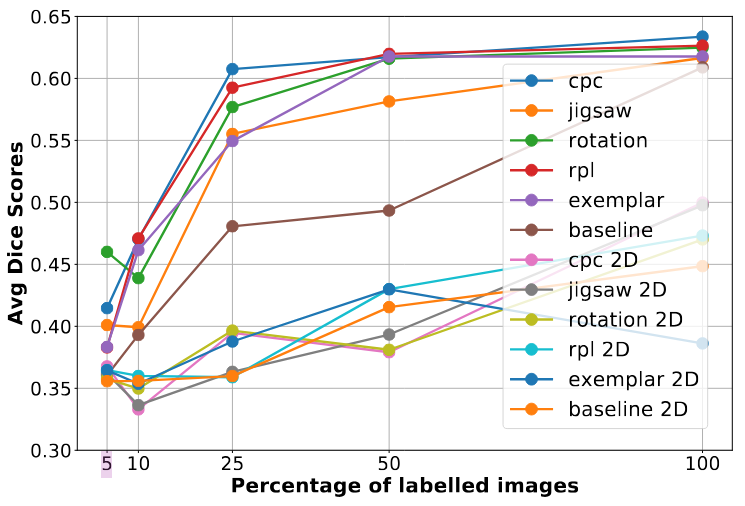

# Self-Supervised Learning for 2D and 3D Medical Imaging Data

## Introduction
This project aims to reimplement the Paper [3D Self-Supervised Methods for Medical Imaging](https://arxiv.org/abs/2006.03829) (original repo can be found [here](https://github.com/HealthML/self-supervised-3d-tasks)).  This paper demonstrates that self-supervised learning (SSL) substantially improves downstream segmentation and classification performance, especially in small data regimes. Their key contributions are: 1) Formulation of five 3D SSL tasks, 2) Open‑source implementations of SSL tasks, and 3) Comprehensive evaluations on pancreas tumor segmentation, brain tumor segmentation, and diabetic retinopathy classification, empirically demonstrating efficiency gains produced by SSL.

## Chosen Result
We recreated the pancreas segmentation data-efficiency curves (left, from Figure 3 of Taleb et al.) on a 3D UNet for four of the five SSL tasks: jigsaw, rotation, rpl, and exemplar. We also recreated the diabetic retinopathy classification data-efficiency curves (right, from Figure 4 of Taleb et al.) on a DenseNet‑121 backbone for the same SSL tasks.

<p float="left">
  
  
</p>

## Code Layout
All code relevant to this project is in the `code` directory. We have split the code into `3d` and `2d` for better separation and understanding of how the pretext and training tasks work. See the [Reproduction Steps](#reproduction-steps) section below on how to install necessary dependencies and run the code.

## Reimplementation Details
Rotation, jigsaw, and RPL are trained with cross entropy loss, targeting 10, 100, and 26 classes respectively. This is computed for $C$ classes is as follows:


For exemplar training, we use a contrastive triplet loss, where the embedding dimension is 1024. This is computed as follows:


We pretrained the model on unlabeled CT volumes and finetuned on the same subsampled sets of labeled scans from the [Medical Segmentation Decathlon dataset](http://medicaldecathlon.com/), assessing downstream performance with Dice score. We also reproduced the diabetic retinopathy data‑efficiency curves (right, from Figure 4 of Taleb et al.) on a DenseNet‑121 backbone. We pretrained the model on [2D UK Biobank fundus images](https://www.kaggle.com/competitions/aptos2019-blindness-detection), and we measured downstream classification performance with Quadratic Weighted Kappa. The finetuning procedure for both tasks involves training on 5%, 10%, 25%, 50%, and 100% (we utilize 5-k fold cross validation for 2D on each data %) of the training data and measuring downstream performance. This result is central to the paper’s main claim that self‑supervised pretraining markedly boosts performance in low‑annotation regimes, providing a clear, quantitative benchmark for comparing the SSL task effectiveness. By faithfully reproducing both results, we confirm that self‑supervised pretraining substantially accelerates convergence and improves accuracy in low‑annotation regimes, and validates our PyTorch implementations.

## Reproduction Steps
This project requires installing Python (preferably 3.12) with the `venv` module.
It also assumes you have CUDA installed, with version 11.8 or greater. If this is
not the case, you may need to modify the PyTorch installation in `setup.sh`.

To start, you must configure your Kaggle account to download the APTOS 2019 Blindness Detection dataset:

1) Ensure you have a Kaggle account created: https://www.kaggle.com/
2) Create a Kaggle API token. To do this, navigate to your Kaggle Settings (https://www.kaggle.com/settings), scroll down, and click "Create New Token". This will download a kagge.json file which you need to move into the root of this repository.
3) Navigate to the APTOS 2019 Blindness Detection Kaggle page (https://www.kaggle.com/competitions/aptos2019-blindness-detection/data), scroll down, and agree to the competition rules. You must do this before Kaggle will let you download the data.

Then, execute the following:

```bash
git clone git@github.com:mattrrubino/self-supervised-medical.git
cd self-supervised-medical
./code/setup.sh
source venv/bin/activate
```

### Running 3D Case
To train and finetune the 3D models, run the following from the project root:

```bash
python code/3d/exp.py
```

Note that this will take several days to run. You can reduce the amount of time it takes by lowering `PRETEXT_EPOCHS` and `FINETUNE_EPOCHS` in `code/3d/exp.py`. However, this will affect performance.

After training the models, you can generate the result graphs by running the following from the project root:

```bash
python code/3d/graph.py
```

The output graph will be located at `results/train_pancreas.png`.

### Running 2D Case
To train and finetune the 2D models, run the following from the project root:

```bash
python code/2d/exp.py
```

Note that this will take a long time to run. You can reduce the amount of time it takes by lowering `PRETEXT_EPOCHS` and `FINETUNE_EPOCHS` in `code/2d/exp.py`. However, this will affect performance.

After training the models, you can generate the result graphs by running the following from the project root:

```bash
python code/2d/graph.py
```

The output graph will be located at `results/train_fundus.png`.

## Results/Insights
Our data efficiency graphs are included below (left is pancreas and right is fundus), where we observe similar trends to the authors. Specifically, all of the pretext tasks, with the exception of exemplar, improve downstream task efficiency.

<p float="left">
  
  
</p>


## Conclusion
Our reimplementation of Taleb et al.’s 3D self-supervised methods proved both challenging and enlightening. The most striking lesson was how dramatically pretraining on unlabeled 3D data improved downstream performance when labeled data was scarce, confirming the paper’s central thesis that self-supervision can address the annotation bottleneck in medical imaging. We encountered unexpected implementation hurdles with memory constraints when scaling to larger 3D volumes, but despite this, our results largely followed the original paper’s. The worse exemplar performance compared to the paper suggests that our negative sampling approach may need to be optimized. In future experiments, we would like to explore more efficient 3D architectures and test them on multimodal datasets as a potential extension of the project. 

## Refernces
[1] 	A. Taleb et al., ‘3D self-supervised methods for medical imaging’, in Proceedings of the 34th 
International Conference on Neural Information Processing Systems, Vancouver, BC, Canada, 2020.
[2] 	O. Ronneberger, P. Fischer, and T. Brox, ‘U-Net: Convolutional Networks for Biomedical Image 
Segmentation’, in Medical Image Computing and Computer-Assisted Intervention -- MICCAI 2015, 2015, pp. 234–241.
[3] 	A. Simpson et al., ‘A large annotated medical image dataset for the development
and evaluation of segmentation algorithms’, CoRR, vol. abs/1902.09063, 2019.
[3] 	M. Karthik and S. Dane, ‘APTOS 2019 Blindness Detection’, Kaggle, 2019.
[5] 	G. Huang, Z. Liu, L. Van Der Maaten, and K. Q. Weinberger, ‘Densely Connected Convolutional 
Networks’, in 2017 IEEE Conference on Computer Vision and Pattern Recognition (CVPR), 2017, pp. 2261–2269.


